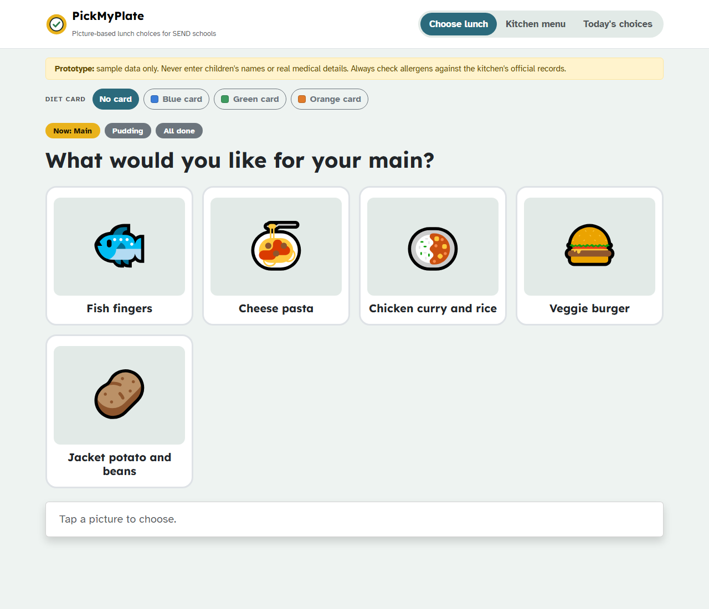

# PickMyPlate

Picture-based, read-aloud lunch choices for children in SEND schools.

Many autistic and non-verbal children find text menus hard to use. PickMyPlate shows today's
menu as large pictures, reads each dish aloud when tapped, and lets the child confirm their
choice one course at a time (Now → Next). Kitchen staff build the menu, tag the UK's 14
allergens, and use anonymous "diet cards" to hide dishes that aren't safe for a child.
Each class signs in with its own login, and every order reaches the kitchen live, labelled with
its school and class, so the kitchen knows exactly what to cook and where to take it.



## Why I built this

I work in the kitchen of a SEND school. Every day I saw children who couldn't read the lunch
menu, so an adult chose for them. PickMyPlate is my attempt to give those children their own choice.

## Features

**For classes** (class login)
- **Choose lunch**: big picture cards, text-to-speech, one course at a time, clear confirm step
- **Diet cards**: colour-coded cards (never children's names) that hide unsafe dishes

**For the kitchen manager** (manager login)
- **Orders**: live orders for School A, School B and the total, a "meals to prepare" table,
  and a serving list for each class, with diet-card meals listed separately
- **Kitchen menu**: the 3-week rotating menu, 14 allergens, fillings and choices, diet filters
- **Schools & classes**: add schools and classes, and create or replace class logins

## Privacy and safety

- No children's names or medical records are stored. Diet cards use colours and codes only.
- Orders record only the school, class, meal and diet card colour.
- Only signed-in classes and the kitchen manager can use the app. The rules in
  [firestore.rules](firestore.rules) stop classes from reading other orders or changing anything.
- Data is stored in Firebase (Google Cloud), in the London region.

## Run it

No build step needed. The app runs on GitHub Pages and uses Firebase for logins and the database.
Follow [SETUP.md](SETUP.md) once to connect it to your own Firebase project.

## Files

```
├── pickmyplate/
│   ├── index.html              Page structure (navbar, tabs, toast)
│   ├── css/style.css           Custom styles on top of Bootstrap 5
│   ├── js/firebase-config.js   Your Firebase project settings
│   ├── js/menu-data.js         Allergens, steps, and the school's 3-week menu
│   ├── js/app.js               Logins, live data, screens and click handling
│   └── img/logo.svg            App logo
├── firestore.rules     Database security rules (who can read and write what)
├── SETUP.md            One-time Firebase setup
├── docs/               Product overview (HTML source) and screenshots
├── DEVLOG.md           Development log
└── BACKLOG.md          Planned tasks
```

Built with HTML, CSS, Bootstrap 5.3, plain JavaScript and Firebase (Authentication + Firestore).

## How it was built

The first prototype (September 2026) was built with AI coding assistance. I'm developing it
further myself, based on feedback from SEND school staff. Progress is recorded in [DEVLOG.md](DEVLOG.md).

## Roadmap

See [BACKLOG.md](BACKLOG.md). Highlights:

- [ ] Feedback from SENCOs, speech and language therapists and kitchen staff
- [ ] Printable A4 picture menu for classrooms
- [ ] Installable on tablets (PWA)
- [x] Share one menu and live orders across devices and schools
- [ ] Accessibility audit (WCAG 2.2 AA) and switch-access support

## Licence

[MIT](LICENSE)
